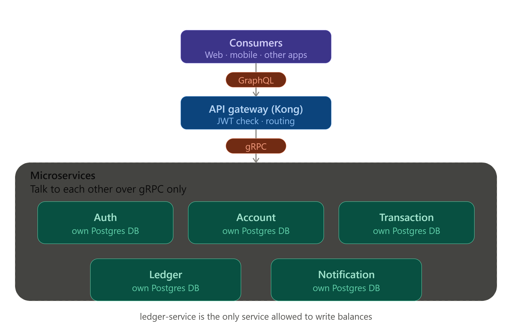
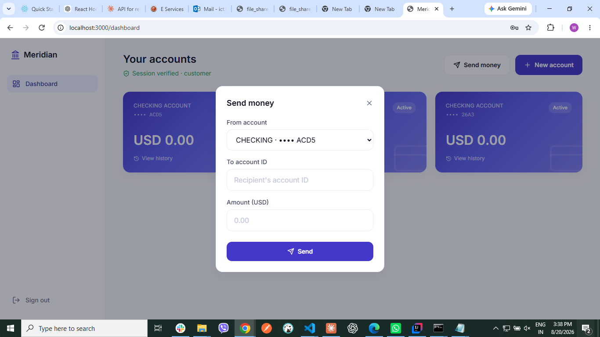
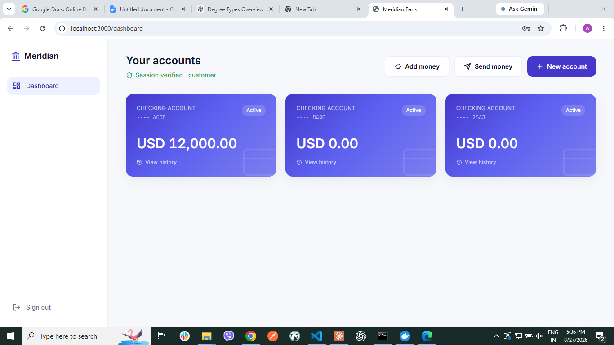
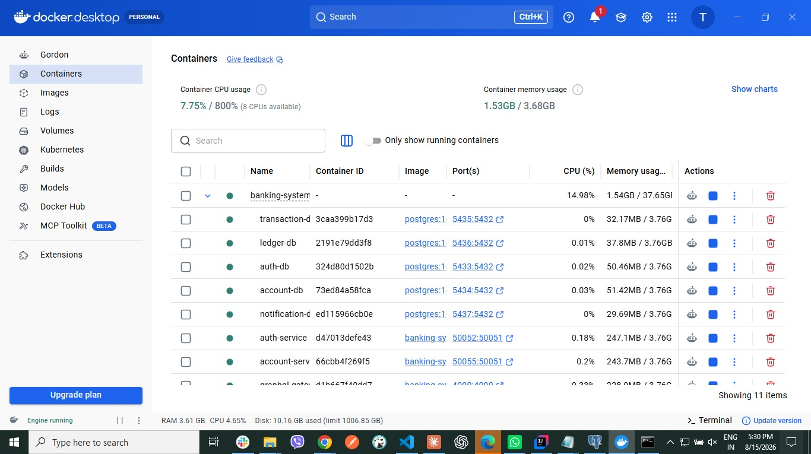
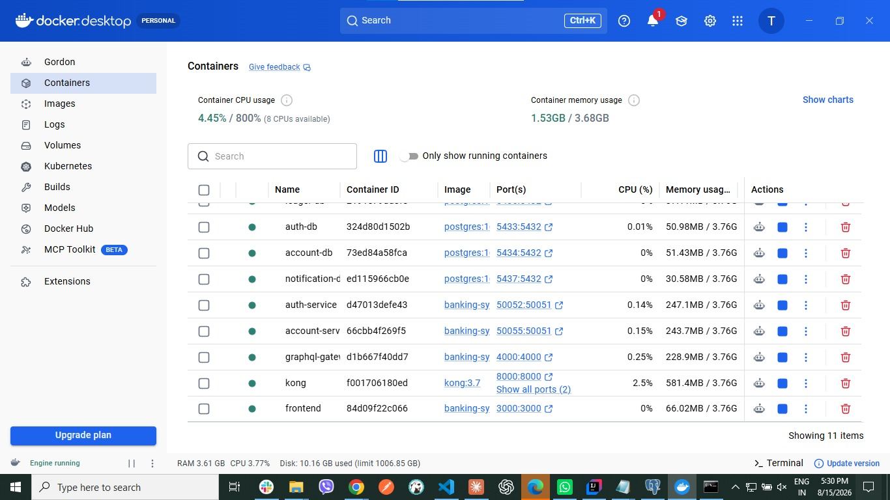

# Banking System — Microservices Architecture

A banking system built on GraphQL, gRPC, and Kong API Gateway — microservices with one isolated Postgres database each, safe money transfers via a Kafka Saga/Outbox flow, and independent identity verification at every service for stronger security.

## Features

* User registration, login, and JWT-based authentication
* Role-based access control (admin / teller permissions)
* Account creation and management (create, view, freeze/update status)
* Deposit and transfer functionality via a Kafka Saga/Outbox flow
* Double-entry ledger for balance and transaction integrity
* Transaction history tracking
* GraphQL API gateway with Kong routing

## Planned
* Withdrawal support
* Email/SMS notifications

## Tech stack

- **Backend**: Java 17, Spring Boot 3.2 (one service per module)
- **Service-to-service**: gRPC — contracts in [`proto/`](./proto)
- **API layer**: GraphQL (`graphql-gateway`) — the only interface clients see
- **API Gateway**: Kong 3.7, declarative config in [`kong/kong.yml`](./kong/kong.yml)
- **Async messaging**: Apache Kafka — Saga/Outbox pattern for transfers
- **Database**: PostgreSQL 16, one instance per service
- **Frontend**: Next.js 14, TypeScript, Tailwind CSS
- **Orchestration**: Docker Compose

Services: `auth-service`, `account-service`, `transaction-service`, `ledger-service`, `notification-service`.

## Run it

```bash
git clone https://github.com/<your-username>/banking-system.git
cd banking-system
docker compose up -d
```

- Frontend: `http://localhost:3000`
- GraphQL through Kong: `http://localhost:8000/graphql`

## Architecture









